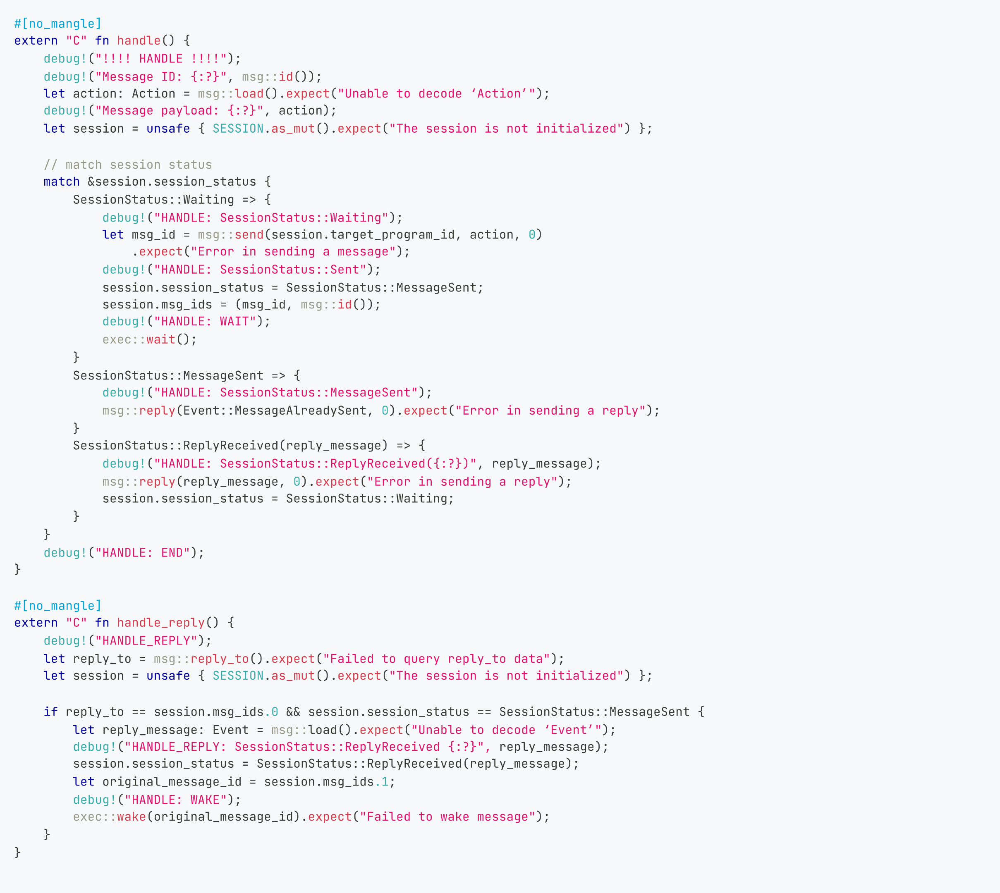

# Handle Reply with wait() and wake()

Now, let's apply understanding of the `exec::wait()`/`exec::wake()` functions to enhance the program introduced in the previous lesson:


The user will now receive a single reply at the end of the entire process, instead of two separate messages.

## Proxy Program

Since the Target program remains unchanged, let's take a closer look at the changes in the Proxy program:

```rust
type SentMessageId = MessageId;
type OriginalMessageId = MessageId;

struct Session {
    target_program_id: ActorId,
    msg_ids: (SentMessageId, OriginalMessageId),
    session_status: SessionStatus,
}
```

New fields have been introduced:
- `msg_ids` — a tuple consisting of two elements: `SentMessageId` and `OriginalMessageId`;
    - `SentMessageId` is the identifier of the message sent to the target program's address.
    - `OriginalMessageId` is the identifier of the message sent to the proxy program by user (required for using the `wake()` function).
- `session_status` - the session status (required to track the stages of session activity).

```rust
enum SessionStatus {
    Waiting,
    MessageSent,
    ReplyReceived(Event),
}
```

- `Waiting` — the session is in a waiting state.
- `MessageSent` - the intermediate session state in which the message was sent to the target program, but the response has not yet been received.
- `ReplyReceived(String)` - the session state when the reply message has been received.

With these new fields in the program structure, initialization is as follows:

```rust
#[no_mangle]
extern "C" fn init() {
    let target_program_id = msg::load().expect("Unable to decode Init");
    unsafe {
        SESSION = Some(Session {
            target_program_id,
            msg_ids: (MessageId::zero(), MessageId::zero()),
            session_status: SessionStatus::Waiting,
        });
    }
}
```

To gain a comprehensive understanding of the process, let's incorporate debugging into the program.

```rust
#[no_mangle]
extern "C" fn handle() {
    debug!("!!!! HANDLE !!!!");
    debug!("Message ID: {:?}", msg::id());
    let action: Action = msg::load().expect("Unable to decode `Action`");
    debug!("Message payload: {:?}", action);
    let session = unsafe { SESSION.as_mut().expect("The session is not initialized") };

    // match session_status
    match &session.session_status {
        SessionStatus::Waiting => {
            debug!("HANDLE: SessionStatus::Waiting");
            let msg_id = msg::send(session.target_program_id, action, 0)
                .expect("Error in sending a message");
            debug!("HANDLE: SessionStatus::Sent");
            session.session_status = SessionStatus::MessageSent;
            session.msg_ids = (msg_id, msg::id());
            debug!("HANDLE: WAIT");
            exec::wait();
        }
        SessionStatus::MessageSent => {
            debug!("HANDLE: SessionStatus::MessageSent");
            msg::reply(Event::MessageAlreadySent, 0).expect("Error in sending a reply");
        }
        SessionStatus::ReplyReceived(reply_message) => {
            debug!("HANDLE: SessionStatus::ReplyReceived({:?})", reply_message);
            msg::reply(reply_message, 0).expect("Error in sending a reply");
            session.session_status = SessionStatus::Waiting;
        }
    }
    debug!("HANDLE: END");
}
```

Initially, the session is in `SessionStatus::Waiting` state. Upon a match, the code switches to the proxy option. The program sends a message, sets the session status to `SessionStatus::MessageSent`, and records the identifiers of the current message from user being processed and message sent to target program. Then, `exec::wait()` is called, pausing message processing and adding the current message to the waiting list until `exec::wake(message_id)` is called or the gas runs out. The ID of the waking message is crucial, hence `msg::id()` is stored in `session.msg_ids`.

Moving to the `handle_reply()` function:

```rust
#[no_mangle]
extern "C" fn handle_reply() {
    debug!("HANDLE_REPLY");
    let reply_to = msg::reply_to().expect("Failed to query reply_to data");
    let session = unsafe { SESSION.as_mut().expect("The session is not initialized") };

    if reply_to == session.msg_ids.0 && session.session_status == SessionStatus::MessageSent {
        let reply_message: Event = msg::load().expect("Unable to decode `Event`");
        debug!("HANDLE_REPLY: SessionStatus::ReplyReceived {:?}", reply_message);
        session.session_status = SessionStatus::ReplyReceived(reply_message);
        let original_message_id = session.msg_ids.1;
        debug!("HANDLE: WAKE");
        exec::wake(original_message_id).expect("Failed to wake message");
    }
}
```

The condition `if reply_to == session.msg_ids.0 && session.session_status == SessionStatus::MessageSent` ensures the expected message has arrived at the right moment, i.e., when the session is in the correct status. The status is then set to `SessionStatus::ReplyReceived(reply_message)`, and the reply message is saved. The ID of the original message is retrieved, and the `exec::wake()` function is called. This function takes the message from the waiting list, and the suspended message resumes processing in the `handle()` function.

*Important note*: When `exec::wake()` is called, and the message returns to the `handle()` entry point, processing starts from the beginning. The program enters the `match` again:

```rust
// ...
match &session.session_status {
    // ...
    SessionStatus::ReplyReceived(reply_message) => {
        debug!("HANDLE: SessionStatus::ReplyReceived({:?})", reply_message);
        msg::reply(reply_message, 0).expect("Error in sending a reply");
        session.session_status = SessionStatus::Waiting;
    }
    // ...
```

However, this time, it proceeds to the third option acoordingly to the session state, sends a reply from Target program to user, and sets the status to `SessionStatus::Waiting`.

Now, let's review this process as a whole:


